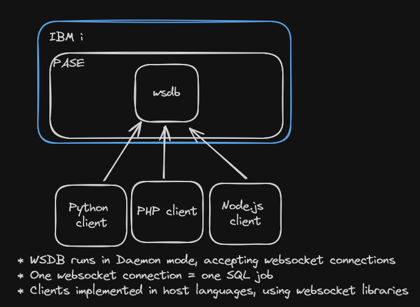

# mapepire-python
<div align="center">
<a href="https://github.com/Mapepire-IBMi/mapepire-python/actions">
    
</a>
<a href="https://pypi.org/project/python-wsdb/">
    
</a>
<a href="https://github.com/Mapepire-IBMi/mapepire-python/blob/main/LICENSE">
    
</a>
<br/>
</div>

- [Overview](#overview)
- [Setup](#setup)
  - [Install with `pip`](#install-with-pip)
  - [Server Component Setup (Forthcoming)](#server-component-setup-forthcoming)
- [Example usage](#example-usage)
- [Development Setup](#development-setup)
  - [Setup python virtual environment with pip and venv](#setup-python-virtual-environment-with-pip-and-venv)
    - [Create a new virtual environment](#create-a-new-virtual-environment)
      - [Unix/macOS](#unixmacos)
      - [Windows](#windows)
    - [Activate the virtual environment:](#activate-the-virtual-environment)
    - [Prepare pip](#prepare-pip)
    - [Install Dependencies using `requirements-dev.txt`](#install-dependencies-using-requirements-devtxt)
  - [Setup Python virtual environment with Conda](#setup-python-virtual-environment-with-conda)
    - [Create an environment from an environment-dev.yml file](#create-an-environment-from-an-environment-devyml-file)
      - [1. Activate the new environment:](#1-activate-the-new-environment)
      - [2. Verify the new environment was installed:](#2-verify-the-new-environment-was-installed)
- [Run local test suite](#run-local-test-suite)


#### ⚠️ (WIP!) This Project is for demo purposes only

## Overview



`mapepire-python` is a Python client implementation that leverages the [CodeFori Server Component](https://github.com/ThePrez/CodeForIBMiServer). 

## Setup

`mapepire-python` requires Python 3.9 or later.

### Install with `pip`

`mapepire-python` is available on [PyPi](https://pypi.org/project/python-wsdb/). Just Run

```bash
pip install python-wsdb
```

### Server Component Setup (Forthcoming)

## Example usage

The following script sets up a `DaemonServer` object that will be used to connect with the Server Component. Then a single `SQLJob` is created to facilitate the connection from the client side. 

```python
from mapepire_python.client.sql_job import SQLJob
from mapepire_python.types import DaemonServer

creds = DaemonServer(
    host="localhost",
    port=8085,
    user="USER",
    password="PASSWORD",
    ignoreUnauthorized=True
)


job = SQLJob()
res = job.connect(creds)
query = job.query("select * from sample.employee")
result = query.run(rows_to_fetch=3)
print(result)
```

Here is the output from the script above:

```json
{
  "id":"query3",
  "has_results":true,
  "update_count":-1,
  "metadata":{
    "column_count":14,
    "job":"330955/QUSER/QZDASOINIT",
    "columns":[
      {
        "name":"EMPNO",
        "type":"CHAR",
        "display_size":6,
        "label":"EMPNO"
      },
      {
        "name":"FIRSTNME",
        "type":"VARCHAR",
        "display_size":12,
        "label":"FIRSTNME"
      },
      {
        "name":"MIDINIT",
        "type":"CHAR",
        "display_size":1,
        "label":"MIDINIT"
      },
      {
        "name":"LASTNAME",
        "type":"VARCHAR",
        "display_size":15,
        "label":"LASTNAME"
      },
      {
        "name":"WORKDEPT",
        "type":"CHAR",
        "display_size":3,
        "label":"WORKDEPT"
      },
      {
        "name":"PHONENO",
        "type":"CHAR",
        "display_size":4,
        "label":"PHONENO"
      },
      {
        "name":"HIREDATE",
        "type":"DATE",
        "display_size":10,
        "label":"HIREDATE"
      },
      {
        "name":"JOB",
        "type":"CHAR",
        "display_size":8,
        "label":"JOB"
      },
      {
        "name":"EDLEVEL",
        "type":"SMALLINT",
        "display_size":6,
        "label":"EDLEVEL"
      },
      {
        "name":"SEX",
        "type":"CHAR",
        "display_size":1,
        "label":"SEX"
      },
      {
        "name":"BIRTHDATE",
        "type":"DATE",
        "display_size":10,
        "label":"BIRTHDATE"
      },
      {
        "name":"SALARY",
        "type":"DECIMAL",
        "display_size":11,
        "label":"SALARY"
      },
      {
        "name":"BONUS",
        "type":"DECIMAL",
        "display_size":11,
        "label":"BONUS"
      },
      {
        "name":"COMM",
        "type":"DECIMAL",
        "display_size":11,
        "label":"COMM"
      }
    ]
  },
  "data":[
    {
      "EMPNO":"000010",
      "FIRSTNME":"CHRISTINE",
      "MIDINIT":"I",
      "LASTNAME":"HAAS",
      "WORKDEPT":"A00",
      "PHONENO":"3978",
      "HIREDATE":"01/01/65",
      "JOB":"PRES",
      "EDLEVEL":18,
      "SEX":"F",
      "BIRTHDATE":"None",
      "SALARY":52750.0,
      "BONUS":1000.0,
      "COMM":4220.0
    }
  ],
  "is_done":false,
  "success":true
}

```

# Development Setup

This guide provides instructions for setting up a Python virtual environment using either `venv` or `conda`.

## Setup python virtual environment with pip and venv

- Create and activate virtual environment
- Prepare pip
- Install packages from `requirements-dev.txt`

### Create a new virtual environment

**Note**: This applies to supported versions of Python 3.8 and higher

navigate to the project's directory and run the following command. This will create a new virtual environment in a local folder named `.venv`

```bash
cd mapepire-python/
```

#### Unix/macOS

```bash
python3 -m venv .venv
```

#### Windows

```bash
py -m venv .venv
```

The second argument is the location of the virtual environment, which will create a the virtual environment in the mapepire-python project root directory: `mapepire-python/.venv`

### Activate the virtual environment:

before installing the project dependencies, `activate` the virtual environment to put the environment-specific `python` and `pip` executables into your shell's `PATH`

#### Unix.macOS

```bash
source .venv/bin/activate
```

#### Windows

```bash
.venv\Scripts\activate
```

Confirm the virtual environment is activated, check the location of the Python interpreter:

#### Unix/macOS

```bash 
which python
```

#### Windows

```bash 
where python
```
Expected output should be:

```bash
.venv/bin/python     # Unix/macOS
.venv\Scripts\python # Windows
```

To deactivate the virtual environment, run:

```bash
deactivate
```

from the `mapepire-python` project directory

### Prepare pip

Make sure pip is up to date:

#### Unix/macOS

```bash
python3 -m pip install --upgrade pip
python3 -m pip --version
```

#### Windows

```bash
py -m pip install --upgrade pip
py -m pip --version
```

### Install Dependencies using `requirements-dev.txt`

Run the following to install the project dependencies:

#### Unix/macOS

```bash
python3 -m pip install -r requirements-dev.txt
```

#### Windows

```bash
py -m pip install -r requirements-dev.txt
```


## Setup Python virtual environment with Conda

First, install Conda if you haven't already by following the instructions in this [guide](https://conda.io/projects/conda/en/latest/user-guide/install/index.html). There are installers for macOS/Windows and Linux. I recommend the following installers for this project:

- [Miniconda](https://docs.anaconda.com/miniconda/)
  - Miniconda is a minimal installer provided by Anaconda.
- [Anaconda](https://www.anaconda.com/download)
  - Anaconda Distribution is a full featured installer that comes with a suite of packages for data science, as well as Anaconda Navigator, a GUI application for working with conda environments.
  
### Create an environment from an environment-dev.yml file

In a terminal, navigate to the `mapepire-python` project directory and run the following command:

```bash 
cd mapepire-python/

conda env create -f environment-dev.yml
```
The `conda env create` command will create a python environment called `mapepire-dev`.

#### 1. Activate the new environment: 
```bash
conda activate mapepire-dev
```

#### 2. Verify the new environment was installed:

```bash
conda env list
```
You can also use conda info --envs.

To deactivate, call:

```bash
conda deactivate
```
## Run local test suite

First, create a `pytest.ini` file in the `tests` directory. 

`tests/pytest.ini`

```ini
[pytest]
env =
    VITE_SERVER=IBMI_SERVER
    VITE_DB_USER=USER
    VITE_DB_PASS=PASS
```

Run the test suite from the `mapepire-python` directory:

```bash
# activate python development environment first

pytest tests/
```


